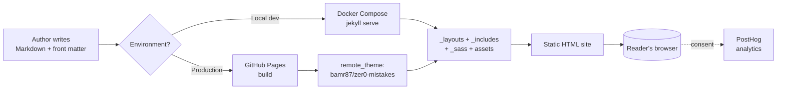

# About Zer0-Mistakes

<p class="lead text-body-secondary mb-4">
  A Docker-first Jekyll theme with Bootstrap 5, an AI-powered installer, and
  automated semantic releases — built so your first <code>docker-compose up</code>
  just works, on any machine.
</p>

## What is Zer0-Mistakes?

**Zer0-Mistakes** is an opinionated Jekyll theme — and accompanying RubyGem
([`jekyll-theme-zer0`](https://rubygems.org/gems/jekyll-theme-zer0)) — for
developers who want a modern, container-friendly, GitHub Pages–compatible
publishing platform that just works on the first try. The name reflects the
guiding principle: every default, script, and workflow in this project exists
to keep new users from making the kinds of small mistakes that derail a Jekyll
setup.

It is built around four pillars:

- 🐳 **Docker-first development** — `docker-compose up` is the only command
  you need to start hacking, regardless of OS or Ruby version.
- 🤖 **AI-powered installation** — a self-healing installer (`install.sh`)
  that detects and recovers from common environment issues automatically.
- 🎨 **Bootstrap 5 + remote-theme support** — modern responsive UI that
  works on GitHub Pages without any custom build step.
- 🚀 **Automated semantic releases** — conventional-commit analysis,
  changelog generation, and gem publishing in a single command.

## Quick Facts

This world was created and is maintained by:

| Name | Profile |
|------|---------|
| Amr Abdelhamed | [github.com/bamr87](https://github.com/bamr87) |

And, most importantly, powered by:

| Name | Link |
|------|------|
| Jekyll | [jekyllrb.com](https://jekyllrb.com/) |
| Bootstrap 5 | [getbootstrap.com](https://getbootstrap.com/) |
| Docker | [docker.com](https://www.docker.com/) |
| GitHub Pages | [pages.github.com](https://pages.github.com/) |
| PostHog | [posthog.com](https://posthog.com/) |

## Architecture at a Glance

The theme follows a layered, modular architecture. Production sites consume it
as a remote theme on GitHub Pages, while local development uses the same files
mounted into a Jekyll container.



The **dual configuration system** (`_config.yml` for production, `_config_dev.yml`
for local overrides) is what lets the same source tree serve both modes without
edits.

## Prerequisites

To run this site — or any site built on the `jekyll-theme-zer0` gem — locally,
you need one of the following toolchains:

**Recommended (Docker-first):**

- [Docker Desktop](https://www.docker.com/products/docker-desktop/) 4.0+ (or
  Docker Engine + Docker Compose v2)
- Git 2.30+

**Alternative (native Ruby):**

- Ruby 3.0+ (3.3 recommended; matches the gem's CI matrix)
- Bundler 2.x (`gem install bundler`)
- Git 2.30+

No prior Jekyll knowledge is required — the installer and Docker Compose file
handle dependency resolution for you.

## Quick Start

The fastest way to spin up a new site using this theme:

```bash
# 1. AI-powered one-line install (creates a new site in ./my-site)
curl -fsSL https://raw.githubusercontent.com/bamr87/zer0-mistakes/main/install.sh | bash -s my-site

# 2. Start the development environment
cd my-site
docker-compose up

# 3. Open http://localhost:4000 in your browser
```

If you prefer to add the theme to an existing Jekyll site, drop these lines
into your `Gemfile` and `_config.yml`:

```ruby
# Gemfile
gem "jekyll-theme-zer0"
```

```yaml
# _config.yml — for local builds
theme: jekyll-theme-zer0

# _config.yml — for GitHub Pages
remote_theme: bamr87/zer0-mistakes
```

Then run `bundle install && bundle exec jekyll serve`.

## Contact Information

If you have any questions, comments, or suggestions, please feel free to reach out to us at:

- 📧 **Email:** [amr.abdel@gmail.com](mailto:amr.abdel@gmail.com)
- 🐛 **Issues / bug reports:** [github.com/bamr87/zer0-mistakes/issues](https://github.com/bamr87/zer0-mistakes/issues)
- 💬 **Discussions / ideas:** [github.com/bamr87/zer0-mistakes/discussions](https://github.com/bamr87/zer0-mistakes/discussions)
- 📦 **Gem on RubyGems:** [rubygems.org/gems/jekyll-theme-zer0](https://rubygems.org/gems/jekyll-theme-zer0)

## FAQ

**Do I need to know Ruby to use this theme?**
No. If you use the Docker-first workflow or consume the theme as a remote theme
on GitHub Pages, Ruby is fully abstracted away. You only need it if you want to
contribute to the theme itself.

**Is this compatible with GitHub Pages?**
Yes. The production `_config.yml` uses `remote_theme: "bamr87/zer0-mistakes"`,
which is on the GitHub Pages allowlist. No custom Actions workflow is required
for a basic deploy.

**Why "zer0-mistakes"?**
The theme is targeted at the `n00b` level (see `level` in `_config.yml`) and
every default is chosen to prevent the most common Jekyll-onboarding mistakes:
wrong Ruby version, broken native extensions, platform-specific Bundler
issues, and Liquid template footguns.

**Does the site track me?**
Analytics ([PostHog](https://posthog.com/)) only load in production *and* only
after the visitor accepts the cookie consent banner. See
[`_includes/analytics/posthog.html`](https://github.com/bamr87/zer0-mistakes/blob/main/_includes/analytics/posthog.html)
and [`_includes/components/cookie-consent.html`](https://github.com/bamr87/zer0-mistakes/blob/main/_includes/components/cookie-consent.html)
for the full implementation.

## Troubleshooting

| Symptom | Likely cause | Fix |
|---------|--------------|-----|
| `docker-compose up` fails on Apple Silicon with platform errors | Container image arch mismatch | The bundled `docker-compose.yml` already pins `platform: linux/amd64` — make sure you haven't removed it. |
| `bundle install` fails with native-extension errors | Missing dev headers / wrong Ruby | Use the Docker workflow, or ensure you're on Ruby 3.0+ with build tools installed. |
| Site builds but theme styles are missing on GitHub Pages | `remote_theme` not enabled | Confirm `remote_theme: bamr87/zer0-mistakes` is set in `_config.yml` and that the `jekyll-remote-theme` plugin is in your `Gemfile`. |
| Pages 404 after deploy | `baseurl` mismatch | If your repo is *not* a `<user>.github.io` repo, set `baseurl: "/<repo-name>"` in `_config.yml`. |

For more, see the project [README](https://github.com/bamr87/zer0-mistakes#troubleshooting)
and the [self-healing installer documentation](https://github.com/bamr87/zer0-mistakes/blob/main/install.sh).

## Next Steps

Now that you know what Zer0-Mistakes is, here's where to go next. These pages
live in the About section of the vault:

```dataview
TABLE description AS Summary
FROM "_about"
WHERE type = "about" AND file.name != "index"
SORT order ASC, title ASC
```

For the full map of the About section, see [[_moc/About|the About Map of Content]].

<div class="alert alert-primary d-flex flex-column flex-md-row align-items-md-center gap-3 mt-4">
  <div class="flex-grow-1">
    <h3 class="h5 mb-1">Ready to ship your own site?</h3>
    <p class="mb-0">
      Spin up a new Zer0-Mistakes site in under a minute with the one-line
      installer — no Ruby setup required.
    </p>
  </div>
  <div class="d-flex flex-wrap gap-2">
    <a class="btn btn-primary" href="https://github.com/bamr87/zer0-mistakes#quick-start">
      Get started
    </a>
    <a class="btn btn-outline-primary" href="https://github.com/bamr87/zer0-mistakes">
      Star on GitHub
    </a>
  </div>
</div>

## Related

- [`AGENTS.md`](https://github.com/bamr87/zer0-mistakes/blob/main/AGENTS.md) — cross-tool entry point for AI coding agents
- [`CONTRIBUTING.md`](https://github.com/bamr87/zer0-mistakes/blob/main/CONTRIBUTING.md) — how to propose changes
- [`CHANGELOG.md`](https://github.com/bamr87/zer0-mistakes/blob/main/CHANGELOG.md) — release history
