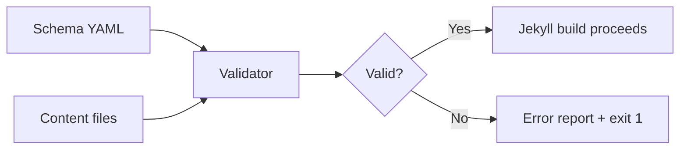

# Config-Driven Frontmatter Validation

The zer0-mistakes theme ships with a schema-driven frontmatter validation system. It catches missing required fields, invalid date formats, and unknown layout references before Jekyll even starts its build, saving time in CI and preventing silent content errors.

## How It Works

The validator reads a YAML schema that defines per-collection rules, then checks every Markdown file's frontmatter against those rules.



## Schema File

The schema lives at:

```text
.github/config/frontmatter_schema.yml
```

### Example Schema

```yaml
collections:
  _posts:
    required:
      - title
      - date
      - categories
    date_fields:
      - date
      - lastmod
    allowed_layouts:
      - article
      - default

  _docs:
    required:
      - title
      - description
      - permalink
    allowed_layouts:
      - default
```

## Running Validation

```bash
# Via the unified validate script
./scripts/bin/validate

# Quick host-only checks (no Jekyll build)
./scripts/bin/validate --quick
```

The validation step is embedded in the standard preflight check and runs automatically in CI before every build.

## CI Integration

The `.github/workflows/` CI pipeline runs `./scripts/bin/validate` on every push and pull request. Frontmatter errors are surfaced as workflow failures with line-level diagnostics.

## AI-Assisted Maintenance

A dedicated Copilot prompt helps you audit and repair frontmatter across the entire site:

```text
.github/prompts/frontmatter-maintainer.prompt.md
```

Use it via GitHub Copilot Chat:

```text
@workspace /frontmatter-maintainer
```

## Frontmatter Standards

All pages in this theme follow a consistent frontmatter schema. Common fields:

| Field | Required | Description |
|---|---|---|
| `title` | ✅ | Human-readable page title |
| `description` | ✅ | SEO meta description (150–160 chars) |
| `layout` | ✅ | Jekyll layout file (without `.html`) |
| `permalink` | ✅ for docs | Canonical URL path |
| `date` | ✅ for posts | ISO 8601 publication date |
| `lastmod` | Recommended | Last modification date (ISO 8601) |
| `categories` | Recommended | Array of category strings |
| `tags` | Recommended | Array of tag strings |
| `draft` | Optional | `true` hides from production builds |

## Troubleshooting

### "Required field missing"

Add the missing field to the page's frontmatter.

### "Unknown layout"

Check that the layout name matches a file under `_layouts/` (without the `.html` extension).

### "Invalid date format"

Use ISO 8601: `YYYY-MM-DD` or `YYYY-MM-DDTHH:MM:SSZ`.

## Related

- [[_docs/development/documentation|Documentation Guide]]
- [[_docs/development/scripts|Scripts Overview]]
- [[_docs/development/ci-cd|CI/CD Pipeline]]

## See also

- [[_docs/development/index|Development]]
- [[_docs/development/testing|Testing]]
- [[_docs/development/ci-cd|CI/CD]]
