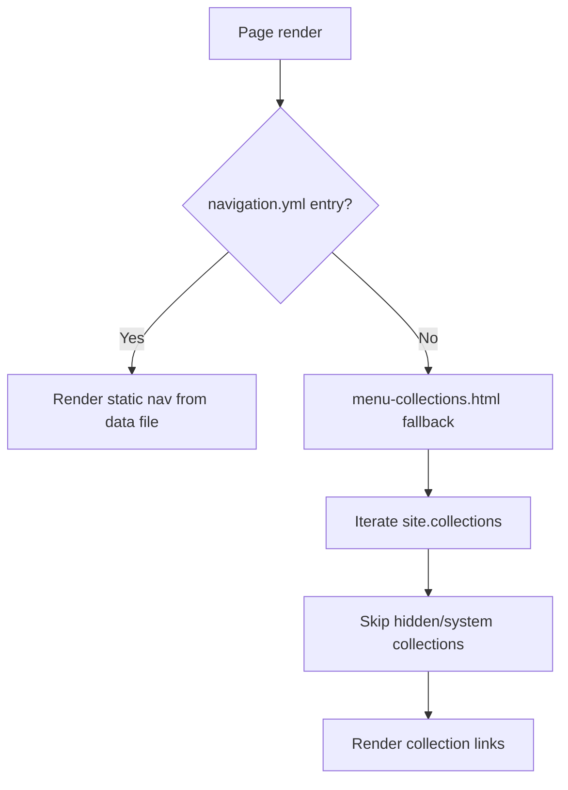

# Dynamic Collection-Based Navigation

zer0-mistakes ships a **zero-config navigation fallback**: when no custom `_data/navigation.yml` entry exists for the navbar, the theme auto-discovers your Jekyll collections and generates a working nav menu on first launch.


## Why It Exists

New sites have no navigation data yet. Without this fallback, visitors would see a blank navbar. The dynamic fallback generates useful links automatically so every new site starts with a navigable structure.

## How It Works



### Key Includes

| File | Role |
|---|---|
| `_includes/navigation/navbar.html` | Main navbar — checks for data, falls back to collections |
| `_includes/navigation/menu-collections.html` | Renders one link per collection |

### Navbar Logic (simplified)

```liquid

  

  

```

## Configuring Static Navigation

Once you're ready to lock down the menu, create `_data/navigation.yml`:

```yaml
main:
  - title: "Home"
    url: "/"
  - title: "Docs"
    url: "/docs/"
  - title: "Posts"
    url: "/posts/"
```

The fallback is silently disabled as soon as this file is present.

## Excluding Collections from the Fallback

Collections prefixed with `_` in the site config can be hidden by setting
`output: false` or by adding them to the exclusion list inside
`menu-collections.html`:

```liquid

  ...

```

## Sidebar Navigation

The sidebar uses a separate `_data/navigation.yml` key (`docs`, `sidebar`, etc.) and is unaffected by the dynamic fallback. See the [[_docs/features/sidebar-navigation|Sidebar Navigation]] guide for details.

## Related

- [[_docs/features/sidebar-navigation|Sidebar Navigation]]
- [[_docs/features/navigation-architecture|ES6 Modular Navigation]]

## See also

- [[_docs/features/index|Features]]
- [[_docs/customization/navigation|Navigation]]
