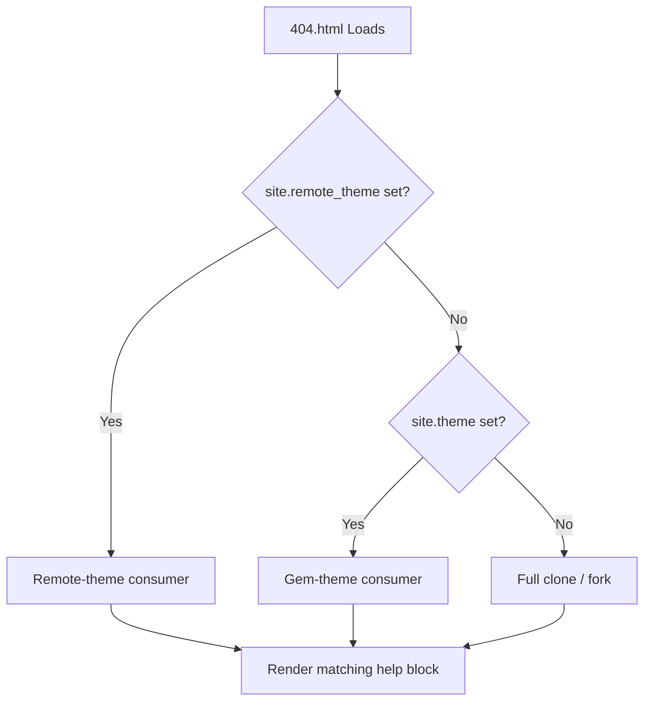

# Smart 404 & Site Configuration Detection

The zer0-mistakes `404.html` is not a plain "page not found" placeholder. It detects how the site is deployed and offers context-aware guidance to the visitor.


## Detection Logic



The Liquid template inspects `site.remote_theme`, `site.theme`, and a small set of
`site.github.*` variables that GitHub Pages injects at build time.

## Implementation

The smart 404 lives in the repository root:

```text
404.html
```

Key Liquid variables used:

| Variable | Purpose |
|---|---|
| `site.remote_theme` | Detect remote-theme mode |
| `site.theme` | Detect gem-theme mode |
| `site.github.owner_name` | Link back to the correct GitHub profile |
| `site.url` / `site.baseurl` | Build absolute links to the home page |

## What Visitors See

### Remote-theme consumer

```text
🔍 Page Not Found
This page doesn't exist on this site.
→ Return to home  → View the theme source on GitHub
```

### Full clone / fork

```text
🔍 Page Not Found
It looks like this page was removed or the URL changed.
→ Return to home  → Browse the docs
```

## Customizing the 404

Override just this file in your site repo:

```text
your-site/
└── 404.html   ← Your custom version takes precedence
```

The theme's `404.html` is only used when no local override exists.

## Related

- [[_docs/getting-started/quick-start|Quick Start Guide]]
- [[_docs/quickstart/bare-minimum|Bare-Minimum Starter]]

## See also

- [[_docs/features/index|Features]]
- [[_docs/getting-started/index|Getting Started]]
