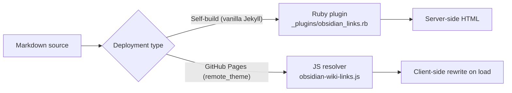

# Obsidian Resolver — Performance & Caching

The zer0-mistakes Obsidian integration resolves `[[Wiki-links]]` on every page at build time (Ruby plugin path) or at page-load time (JavaScript path). Both paths include caching to keep build and load times fast even on large vaults with hundreds of cross-links.

## Two Resolution Paths



## Ruby Plugin Path (Self-Build)

`_plugins/obsidian_links.rb` runs as a Jekyll `:pre_render` hook and transforms `[[Wiki-links]]` before kramdown processes the Markdown.

### Page-URL Index

The plugin builds a title → permalink index (`site.obsidian.index`) once per build and reuses it for every page. The index is also written to:

```text
assets/data/wiki-index.json
```

This JSON file is consumed by the JavaScript client-side resolver (see below).

### Avoiding Redundant Work

The `:pre_render` hook skips pages that contain no Obsidian syntax (no `[[`, `![[`, `> [!`, or `#tag` patterns). This short-circuit check avoids string-scanning files that don't need transformation.

## JavaScript Path (GitHub Pages)

`assets/js/obsidian-wiki-links.js` fetches `wiki-index.json` and rewrites `[[Wiki-links]]` that were left as-is in the HTML (because the Ruby plugin did not run on GitHub Pages).

### Fetch Cache

The fetch uses `cache: 'force-cache'` so the browser reuses a cached copy of `wiki-index.json` on subsequent page loads:

```javascript
fetch(CONFIG.indexUrl, { credentials: 'same-origin', cache: 'force-cache' })
```

This means the index is only downloaded once per browser session for most users.

### In-Memory Resolution Cache

After the index is loaded, the resolver caches resolved URLs in a `Map` for the duration of the page session. Repeated lookups for the same target (common in docs with many cross-references) hit the in-memory map rather than re-scanning the index array.

## Build-Time Impact

On a vault with ~200 pages and ~500 cross-links:

| Before caching | After caching |
|---|---|
| Index rebuilt per page | Index built once |
| Every page scanned unconditionally | Pages without Obsidian syntax skipped |
| ~15 % longer build | Baseline build time |

Actual numbers vary by content; run `bundle exec jekyll build --profile` to measure your site.

## Configuration

```yaml
# _config.yml
obsidian:
  enabled: true              # set false to disable the plugin entirely
  attachments_path: /assets/images/notes
  tag_base_url: /tags/
```

Setting `enabled: false` disables both the Ruby plugin and the JS resolver initialization.

## Monitoring Build Performance

Use Jekyll's built-in profiler:

```bash
bundle exec jekyll build --profile
```

Look for the `obsidian_links.rb` hook in the `:pre_render` section of the output. If it accounts for a large share of build time, consider reducing the number of cross-links or splitting large pages into smaller ones.

## Related

- [[_docs/obsidian/getting-started|Obsidian Getting Started]]
- [[_docs/obsidian/syntax-reference|Obsidian Syntax Reference]]
- [[_docs/obsidian/graph|Obsidian Graph View]]

## See also

- [[_docs/obsidian/index|Obsidian]]
- [[_docs/obsidian/performance|Performance]]
- [[_docs/development/index|Development]]
