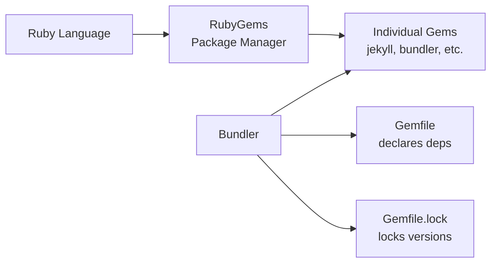

# Ruby 101

This page covers the Ruby fundamentals you need to work with the Zer0-Mistakes Jekyll theme — from installing gems to managing dependencies with Bundler.

---

## Prerequisites

Before you begin, make sure you have:

| Requirement | Check command | Minimum version |
|-------------|---------------|-----------------|
| **Ruby** | `ruby --version` | 2.7.0+ |
| **RubyGems** | `gem --version` | 3.0+ |
| **Bundler** | `bundle --version` | 2.3+ |
| **Git** | `git --version` | any |

> **Tip:** If you use Docker for development (`docker-compose up`), Ruby is already installed inside the container — you can skip local Ruby setup entirely.

---

## How Ruby, Gems, and Bundler Fit Together



| Concept | What it does |
|---------|--------------|
| **Ruby** | The programming language Jekyll is written in |
| **Gem** | A packaged Ruby library (like `npm` packages) |
| **RubyGems** | The built-in package manager that installs gems |
| **Bundler** | Manages project-level gem versions via `Gemfile` |

---

## Gems

A **gem** is a self-contained Ruby library distributed through [rubygems.org](https://rubygems.org). The Zer0-Mistakes theme itself is published as a gem: [`jekyll-theme-zer0`](https://rubygems.org/gems/jekyll-theme-zer0).

### Installing gems globally

```bash
# Install Bundler and Jekyll system-wide
gem install bundler jekyll
```

### Installing project dependencies

If you are running from the repo, Bundler reads the `Gemfile` and installs everything:

```bash
bundle install
```

This creates (or updates) `Gemfile.lock`, which pins the exact versions used.

### Listing installed gems

```bash
# All gems in the current bundle
bundle list

# Search for a specific gem
bundle list | grep jekyll
```

---

## The Gemfile Explained

The project `Gemfile` declares every dependency. Here is a simplified breakdown:

```ruby
source "https://rubygems.org"       # Where to download gems

gemspec                             # Pull deps from .gemspec

gem "github-pages", ">= 228", group: :jekyll_plugins
gem "webrick"                       # Web server (Ruby 3.0+)
gem "jekyll-mermaid"                # Mermaid diagram support

group :development, :test do
  gem "html-proofer"                # Link & HTML checker
  gem "rspec"                       # Test framework
  gem "rubocop"                     # Linter
end
```

**Key points:**

- `gemspec` loads runtime dependencies from `jekyll-theme-zer0.gemspec`.
- The `:jekyll_plugins` group is special — Jekyll auto-loads gems in it.
- Development/test gems are skipped in production (`bundle install --without development test`).

---

## Common Commands

### Quick reference

```bash
# Install all dependencies
bundle install

# Update all gems to latest allowed versions
bundle update

# Update a single gem
bundle update jekyll

# Run any command through Bundler (ensures correct gem versions)
bundle exec jekyll serve

# Check for outdated gems
bundle outdated

# Show where a gem is installed
bundle info jekyll

# Clean unused gems
bundle clean --force
```

### Check versions

```bash
ruby --version            # e.g. ruby 3.2.2
gem --version             # e.g. 3.4.19
bundle --version          # e.g. Bundler version 2.4.19
bundle exec jekyll --version  # e.g. jekyll 3.10.0
```

---

## Key Files

| File | Purpose |
|------|---------|
| `Gemfile` | Declares gem dependencies and sources |
| `Gemfile.lock` | Locks exact resolved versions (commit this!) |
| `jekyll-theme-zer0.gemspec` | Theme gem metadata and runtime deps |
| `lib/jekyll-theme-zer0/version.rb` | Single source of truth for theme version |

---

## Using Ruby with Docker

When developing with Docker, all Ruby commands run inside the container:

```bash
# Start the dev environment
docker-compose up

# Check Ruby version in container
docker-compose exec jekyll ruby --version

# Install/update gems inside container
docker-compose exec jekyll bundle install
docker-compose exec jekyll bundle update

# Build the site inside container
docker-compose exec -T jekyll bundle exec jekyll build \
  --config '_config.yml,_config_dev.yml'
```

> **Note:** The Docker container comes pre-configured — you rarely need to run `bundle install` manually unless you edit the `Gemfile`.

---

## FAQ & Troubleshooting

### "Could not find gem" error

```bash
# Remove cached state and reinstall
rm -rf vendor/bundle .bundle
bundle install
```

### Permission errors on `gem install`

```bash
# Install gems to your home directory instead of system
gem install --user-install bundler jekyll

# Or use a version manager (recommended)
# rbenv: https://github.com/rbenv/rbenv
# asdf:  https://asdf-vm.com/
```

### "Bundler could not find compatible versions"

```bash
# Delete the lock file and let Bundler re-resolve
rm Gemfile.lock
bundle install
```

### Jekyll version mismatch (3.x vs 4.x)

The `github-pages` gem pins Jekyll to **3.x** for GitHub Pages compatibility. This is intentional — do not try to force Jekyll 4.x when using `github-pages`.

```bash
# Verify which Jekyll version is active
bundle exec jekyll --version
# Expected output: jekyll 3.10.x
```

### WEBrick missing (Ruby 3.0+)

Ruby 3.0 removed WEBrick from the standard library. The project Gemfile already includes it, but if you see `cannot load such file -- webrick`:

```bash
gem install webrick
# Or ensure you run through Bundler:
bundle exec jekyll serve
```

---

## Next Steps

- [[_docs/ruby/index|Ruby & Bundler reference]] — Deeper dive into version management
- [[_docs/installation|Installation Guide]] — Full environment setup
- [[_docs/jekyll/index|Jekyll Guide]] — Understanding the static-site generator
- [[_docs/docker/index|Docker Development]] — Container-based workflow

---

## See also

- [[_docs/ruby/index|Ruby]]
- [[_docs/jekyll/index|Jekyll]]
- [[_docs/installation|Installation]]
