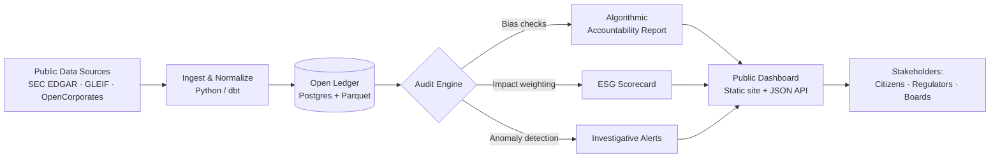

In a stunning turn of events, the world was saved from the clutches of capitalism by a wizard who used non-arcane magic—practical technology and ethical reasoning—to eliminate the evils of the system while still maintaining shareholder value. The wizard, known only as Merlin Financialis, has been hailed as a hero for his groundbreaking efforts to expose the financial puppeteering that has plagued humanity for generations.

> ⚠️ **Satire notice**: This post is a tongue-in-cheek allegory. The wizard is fictional; the tools, frameworks, and patterns referenced below are very real and linked at the end.

## Prerequisites

You don't need a wand to follow along—just a working developer environment and a willingness to question defaults. Before applying the techniques in this post you should have:

- **A modern Git workflow** — comfort with branches, pull requests, and code review.
- **Basic data tooling** — Python 3.10+ *or* Node.js 18+ for the snippets below; `pandas` or any tabular library helps.
- **A containerized dev environment** — this site uses [[_posts/2025-01-15-docker-jekyll-guide|Docker-first Jekyll]]; the same pattern applies to the auditing tools we discuss.
- **Familiarity with public APIs** — most of the "transparency" tooling below is built on top of open government and exchange APIs (SEC EDGAR, OpenCorporates, GLEIF).
- **An ethical framework you've read at least once** — for example the [ACM Code of Ethics](https://www.acm.org/code-of-ethics) or the [IEEE Ethically Aligned Design](https://standards.ieee.org/industry-connections/ec/autonomous-systems/) report.

If any of those are missing, treat the rest of this post as inspiration rather than a checklist.

## Unraveling the Web of Corruption

Using a combination of common sense and general ethics, Merlin Financialis was able to unravel the intricate web of corruption and greed that had resulted in widespread inequality and suffering across the globe. Through his magical abilities—a metaphor for transparent data analysis and open-source auditing tools—he was able to shine a light on the dark underbelly of capitalism, revealing the true extent of the exploitation and manipulation that had been occurring behind closed doors.

His approach combined several key principles that any modern technologist can adopt:

- **Radical transparency**: Making financial data openly accessible and auditable by the public.
- **Algorithmic accountability**: Ensuring that automated decision-making systems are fair, explainable, and free from discriminatory bias.
- **Ethical engineering**: Building technology that prioritizes human well-being over profit maximization.

## Enacting Sweeping Financial Reform

With a wave of his wand, Merlin Financialis enacted sweeping changes that not only eradicated the corrupt practices that had been holding society back, but also ensured that shareholders were still able to see a return on their investments. By promoting transparency, accountability, and fair business practices, he was able to create a new financial system that prioritized the well-being of all individuals, rather than the profits of a select few.

The reforms centered on three pillars:

1. **Open financial ledgers** — leveraging distributed ledger technology to make transactions publicly verifiable without sacrificing individual privacy.
2. **Stakeholder-first governance** — restructuring corporate boards to include employee and community representatives alongside shareholders.
3. **Impact-weighted accounting** — measuring corporate success not only by revenue, but by social and environmental outcomes.

## A Call to Action for Technologists

In a statement released to the press, Merlin Financialis emphasized the importance of using magic for the greater good, rather than personal gain. He urged others in positions of power to follow his lead and work towards creating a more just and equitable world for all.

> "The tools we build shape the world we live in. Every line of code is a choice between reinforcing the status quo and building something better."
> — Merlin Financialis

This message resonates strongly in the technology and development community, where engineers increasingly grapple with the ethical implications of the systems they create—from recommendation algorithms that amplify misinformation to financial platforms that deepen inequality.

## Looking Ahead: A Brighter Future

As news of Merlin Financialis' heroic actions spread, the world rejoiced at the prospect of a brighter future free from the shackles of capitalism. With his non-arcane magic and unwavering commitment to ethical principles, this wizard has truly proven that anything is possible when we harness our abilities for the betterment of humanity.

While this tale is satirical, the underlying themes are anything but fictional. The rise of fintech regulation, ESG (Environmental, Social, and Governance) investing, and ethical AI frameworks shows that the real-world movement toward accountable, equitable technology is well underway. The question is not whether change will come, but whether technologists will lead it—or be led by it.

## The Wizard's Workshop: How the Spell Actually Works

Strip away the robe and the staff, and "Merlin's magic" is just a small, well-composed open-source pipeline. The diagram below shows how raw public data becomes the kind of accountability artifact a journalist, regulator, or DAO can act on.



Each node maps to a real, swappable piece of software—nothing proprietary, nothing arcane.

### Example 1: A Transparent Financial Ingest

Most "radical transparency" projects start with a boring 30-line script that pulls a public filing and writes it somewhere queryable. Here is a minimal SEC EDGAR ingest in Python:

```python
# scripts/ingest_edgar.py
import json
from pathlib import Path
import requests

UA = {"User-Agent": "merlin-financialis contact@example.org"}
OUT = Path("data/filings")
OUT.mkdir(parents=True, exist_ok=True)

def fetch_company_facts(cik: str) -> dict:
    """Fetch a company's structured XBRL facts from SEC EDGAR."""
    url = f"https://data.sec.gov/api/xbrl/companyfacts/CIK{cik.zfill(10)}.json"
    r = requests.get(url, headers=UA, timeout=30)
    r.raise_for_status()
    return r.json()

if __name__ == "__main__":
    # Apple Inc. = CIK 0000320193
    facts = fetch_company_facts("320193")
    (OUT / "AAPL.json").write_text(json.dumps(facts, indent=2))
    print(f"Wrote {len(facts.get('facts', {}))} fact namespaces")
```

Run it, commit the output to a public repo, and you have built the first stone of an "open ledger." No spellbook required.

### Example 2: Algorithmic Accountability Check

The wizard's second trick is auditing the models that allocate capital. Tools like [Fairlearn](https://fairlearn.org/) or [AI Fairness 360](https://aif360.res.ibm.com/) make this approachable:

```python
# scripts/audit_model.py
from fairlearn.metrics import MetricFrame, selection_rate, demographic_parity_difference
from sklearn.metrics import accuracy_score

# y_true, y_pred, and `sensitive` (e.g. zip-code-derived demographic) come from your model
metrics = MetricFrame(
    metrics={"accuracy": accuracy_score, "selection_rate": selection_rate},
    y_true=y_true,
    y_pred=y_pred,
    sensitive_features=sensitive,
)

print(metrics.by_group)
print("Demographic parity gap:",
      demographic_parity_difference(y_true, y_pred, sensitive_features=sensitive))
```

If the gap is non-trivial, that's your spellcheck failing. Document it, file an issue, and refuse to ship until it's addressed.

### Example 3: Impact-Weighted Accounting Config

Impact-weighted accounting can be expressed declaratively. Here's a starter `impact-weights.yml` you can drop into any reporting pipeline:

```yaml
# impact-weights.yml
version: 1
weights:
  financial:
    revenue: 1.0
    operating_margin: 0.8
  social:
    living_wage_compliance: 1.2
    workforce_diversity: 0.6
    workplace_safety: 1.0
  environmental:
    scope1_emissions: -1.5     # negative = penalizes harm
    scope2_emissions: -1.0
    scope3_emissions: -0.5
    water_intensity: -0.4
thresholds:
  publish_alert_if_score_below: 0.0
report:
  format: [html, json]
  destination: s3://transparency-reports/
```

Combine the YAML with a small scoring function and you have the third pillar—measurable, version-controlled, and PR-reviewable corporate impact.

## A Practitioner's Checklist

Before declaring a project "Merlin-grade," confirm:

- [ ] Source data and transformations are in a public repo (or at least an internal one with read access for auditors).
- [ ] Every model has a published model card and a fairness report.
- [ ] Stakeholder representatives (employees, customers, affected communities) are listed in the governance README.
- [ ] Impact metrics are part of the same dashboard as financial metrics—not a separate "ESG appendix."
- [ ] There is a clear, low-friction channel for whistleblowers and external researchers to file findings.

## FAQ & Troubleshooting

**Q: Isn't "shareholder value plus ethics" a contradiction?** Not necessarily. Frameworks like [B Corp certification](https://www.bcorporation.net/) and the [Embankment Project for Inclusive Capitalism](https://www.epic-value.com/) demonstrate that long-horizon shareholder returns are *positively* correlated with stakeholder welfare. The contradiction only appears under quarterly-earnings tunnel vision.

**Q: My company won't open-source its financials. Can I still apply any of this?** Yes. Start internally: open the data lake to all employees, publish model cards on the intranet, and add fairness checks to your CI pipeline. Internal transparency is a credible first move.

**Q: The fairness audit flagged a large parity gap. What now?** Don't ship. Document the gap, investigate root causes (training data skew, feature proxies, labeling bias), and consider mitigations like re-weighting, threshold optimization, or removing the model entirely. "We knew and shipped anyway" is worse than "we found nothing."

**Q: Mermaid diagram isn't rendering on my fork of the theme.** Make sure the page front matter contains `mermaid: true`. The Zer0-Mistakes theme only loads the Mermaid bundle when that flag is set—see [`_includes/components/mermaid.html`](https://github.com/bamr87/zer0-mistakes/blob/main/_includes/components/mermaid.html) for the implementation.

**Q: The SEC EDGAR script returns 403.** EDGAR requires a descriptive `User-Agent` with a contact email. Update the `UA` dict in the snippet above and avoid hammering the API—stay under 10 requests/second.

## Related Posts & Further Reading

- [[_posts/2025-01-01-getting-started-jekyll|Getting Started with Jekyll: Your First Static Site]] — publish your own transparency dashboard with the same theme.
- [[_posts/2025-01-15-docker-jekyll-guide|Mastering Docker with Jekyll]] — reproducible environments are the foundation of reproducible audits.
- [[_posts/2025-01-05-web-accessibility-guide|Web Accessibility Guide]] — accountability dashboards must be usable by everyone, not just analysts.
- [[_posts/2025-01-10-bootstrap-5-components|Bootstrap 5 Components in Action]] — the UI toolkit used for the public dashboard mock-up above.

External primers:

- [SEC EDGAR XBRL API documentation](https://www.sec.gov/edgar/sec-api-documentation)
- [Fairlearn user guide](https://fairlearn.org/main/user_guide/index.html)
- [Harvard Business School: Impact-Weighted Accounts Project](https://www.hbs.edu/impact-weighted-accounts/)
- [GLEIF Legal Entity Identifier](https://www.gleif.org/) — global, free, open corporate identity data.

## Next Steps

1. **Fork this post's pipeline.** Start with the EDGAR snippet, point it at a company you care about, and commit the JSON output to a public repo.
2. **Add one fairness check** to a model already in production this quarter. Just one. Measure the result.
3. **Propose an impact-weighted KPI** at your next planning meeting. Use the YAML schema above as a strawman.
4. **Open an issue** on the [zer0-mistakes repo](https://github.com/bamr87/zer0-mistakes/issues) if you'd like a follow-up post that walks through deploying the dashboard end-to-end.

The wizard's real magic was simply *refusing to look away*. The tools have been on the shelf the whole time.

---

### Suggested Asset Backlog

The following assets are referenced or would further enrich this post and are tracked here for future contributors:

- `/images/wizard-on-journey.png` — **already exists** (used as preview).
- `/images/posts/transparency-pipeline.svg` — exported diagram of the Mermaid flow above (for social sharing cards where Mermaid won't render).
- `/images/posts/dashboard-mockup.png` — screenshot of a sample public-dashboard built on the pipeline.
- `/_data/impact_weights_example.yml` — companion data file containing the YAML snippet above so it can be `include`d in other posts.
