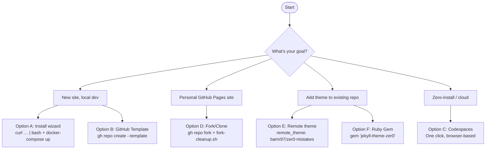

# Quick Start Guide

Get your **zer0-mistakes** Jekyll site running in under 5 minutes. Choose the path that fits your goal:



## ⚡ Fastest Start (1 Command) {#fastest-start-1-command}

```bash
mkdir my-site && cd my-site
curl -fsSL https://raw.githubusercontent.com/bamr87/zer0-mistakes/main/install.sh | bash
docker-compose up
```

Your site will be live at `http://localhost:4000`.


## What You Get

- **Docker environment** — consistent dev setup across macOS, Linux, and Windows (WSL)
- **Bootstrap 5.3.3** — vendored, responsive, dark-mode-ready
- **Live reload** — browser updates on every file save
- **GitHub Pages compatible** — push to `main`, site deploys automatically
- **Privacy-first analytics** — PostHog with consent gate, disabled in dev

## Installation Options {#installation-options}

| Path | Method | Best For |
|------|--------|----------|
| **A** | Install wizard (one-liner) | Brand-new local site |
| **B** | GitHub Template | Clean copy via GitHub UI or CLI |
| **C** | GitHub Codespaces | Zero-install, browser-based dev |
| **D** | Fork/Clone | Personal `username.github.io` site |
| **E** | Remote theme | Add theme to an existing repo |
| **F** | Ruby Gem | Traditional Bundler workflow |

### Option A — Install Wizard

```bash
mkdir my-site && cd my-site
curl -fsSL https://raw.githubusercontent.com/bamr87/zer0-mistakes/main/install.sh | bash
docker-compose up
```

### Option B — GitHub Template

1. Go to [github.com/bamr87/zer0-mistakes](https://github.com/bamr87/zer0-mistakes)
2. Click **Use this template** → **Create a new repository**
3. Clone your new repo and run `docker-compose up`

Or via CLI:

```bash
gh repo create my-site --template bamr87/zer0-mistakes --clone
cd my-site && docker-compose up
```

### Option C — GitHub Codespaces

[](https://codespaces.new/bamr87/zer0-mistakes)

Or: repo page → **Code** → **Codespaces** → **Create codespace on main**.

### Option D — Fork/Clone (Personal Site)

Fork into `<your-username>.github.io` to get your own GitHub Pages site:

```bash
gh repo fork bamr87/zer0-mistakes --clone
cd zer0-mistakes
./scripts/fork-cleanup.sh   # interactive config wizard
docker-compose up
```

Enable Pages: **Settings → Pages → Branch: main → Save**.

See [docs/FORKING.md](https://github.com/bamr87/zer0-mistakes/blob/main/docs/installation/forking.md) for the full fork → configure → personalize guide.

### Option E — Remote Theme

```yaml
# _config.yml
remote_theme: "bamr87/zer0-mistakes"
plugins:
  - jekyll-remote-theme
```

Enable GitHub Pages in your repo's **Settings → Pages**.

### Option F — Ruby Gem

```ruby
# Gemfile
gem "jekyll-theme-zer0"
```

```yaml
# _config.yml
theme: "jekyll-theme-zer0"
```

```bash
bundle install && bundle exec jekyll serve
```

## Setup Guides {#essential-setup}

| Guide | Purpose | Time | Difficulty |
|-------|---------|------|------------|
| **[[_quickstart/machine-setup|Machine Setup]]** | Install Docker, Git, GitHub CLI | 10 min | Beginner |
| **[[_quickstart/jekyll-setup|Jekyll Setup]]** | Run the dev server, create content | 5 min | Beginner |
| **[[_quickstart/github-setup|GitHub Setup]]** | Fork, deploy to GitHub Pages | 10 min | Intermediate |
| **[[_quickstart/personalization]]** | Configure `_config.yml` for your site | 5 min | Beginner |

## Quick Troubleshooting

**Port 4000 in use**

```bash
lsof -i :4000          # see what's running
docker-compose down    # stop any existing containers
docker-compose up      # restart
```

**Docker platform warnings (Apple Silicon)**

This is expected — `docker-compose.yml` already sets `platform: linux/amd64`. The site works normally.

**Jekyll build errors**

```bash
docker-compose exec jekyll bundle exec jekyll doctor
docker-compose exec jekyll bundle exec jekyll build --trace
```

**Validate your setup:**

```bash
docker-compose exec -T jekyll bundle exec jekyll build \
  --config '_config.yml,_config_dev.yml'
```

## Need Help?

| Resource | Purpose |
|----------|---------|
| [GitHub Issues](https://github.com/bamr87/zer0-mistakes/issues) | Bug reports and technical support |
| [Discussions](https://github.com/bamr87/zer0-mistakes/discussions) | Community Q&A and feature requests |
| [[_docs/installation|Installation Guide]] | Deep-dive setup documentation |

---

Start with **[[_quickstart/machine-setup|Machine Setup →]]** if this is your first time, or jump straight to [Installation Options](#installation-options) to pick your path.
