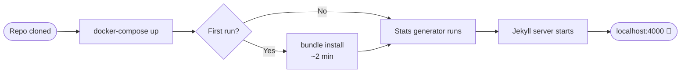

# Jekyll Setup

Start your Docker-based Jekyll development server and create your first content. **No local Ruby installation needed** — everything runs inside the container.



## Prerequisites

Complete [[_quickstart/machine-setup|Machine Setup]] first (Docker Desktop, Git, GitHub CLI).

## Step 1 — Clone the Repo

If you haven't cloned yet:

```bash
gh repo clone bamr87/zer0-mistakes
cd zer0-mistakes
```

Or if you used the install wizard, you're already in the right directory.

## Step 2 — Start the Dev Server

```bash
docker-compose up
```

On first run, Docker:
1. Pulls the Jekyll image (≈ 1–2 min)
2. Runs `bundle install` inside the container
3. Runs `_data/generate_statistics.sh` to build site stats
4. Starts Jekyll with live reload

Your site is available at **[http://localhost:4000](http://localhost:4000)**.


## Step 3 — Check Site Health

```bash
docker-compose exec jekyll bundle exec jekyll doctor
```


Expected output:

```
Configuration file: /app/_config.yml
           Source: /app
      Destination: /app/_site
 Incremental build: enabled
      Generating: done in X seconds.
```

## Essential Commands

```bash
# Start server (foreground — shows live logs)
docker-compose up

# Start detached
docker-compose up -d && docker-compose logs -f

# Stop server
docker-compose down

# Force rebuild (after Gemfile or Dockerfile changes)
docker-compose down && docker-compose up --build

# Shell into the container
docker-compose exec jekyll bash

# Build for production (no watch)
docker-compose exec -T jekyll bundle exec jekyll build \
  --config '_config.yml,_config_dev.yml'
```

## Configuration Files

The theme uses **two layered configs** — dev overrides production:

### `_config.yml` (production)

```yaml
title: "Your Site Title"
description: "Your site description"
url: "https://yourdomain.com"
baseurl: ""

remote_theme: "bamr87/zer0-mistakes"

plugins:
  - github-pages
  - jekyll-remote-theme
  - jekyll-feed
  - jekyll-sitemap
  - jekyll-seo-tag
  - jekyll-paginate
  - jekyll-relative-links
  - jekyll-redirect-from
  - jekyll-include-cache
```

### `_config_dev.yml` (development overrides)

```yaml
url: "http://localhost:4000"
baseurl: ""

# Use local theme files instead of remote
theme: "jekyll-theme-zer0"
remote_theme: false

livereload: true
incremental: true
show_drafts: true
future: true
```

> Bootstrap 5.3.3 is **vendored** in `assets/vendor/` — there are no `bootstrap:` config keys.

## Create Your First Post

Posts live in `pages/_posts/`. Filename format: `YYYY-MM-DD-slug.md`.

```bash
cat > pages/_posts/$(date +%Y-%m-%d)-my-first-post.md << 'EOF'
---
title: "My First Post"
description: "Hello from zer0-mistakes"
date: 2026-05-30T00:00:00.000Z
layout: article
tags: [hello-world]
categories: [Blog]
---
Hello, world! This is my first post.
EOF
```

Jekyll picks it up immediately (live reload refreshes the browser).

## Project Structure

```
zer0-mistakes/
├── _config.yml          # Production config
├── _config_dev.yml      # Dev overrides (loaded by docker-compose)
├── docker-compose.yml   # Container definition
├── pages/
│   ├── _posts/          # Blog posts
│   ├── _docs/           # Documentation pages
│   └── _quickstart/     # This guide
├── _layouts/            # Page templates
├── _includes/           # Reusable components
├── _sass/               # Sass partials
└── assets/
    ├── css/             # Compiled CSS + custom overrides
    ├── js/              # JavaScript modules
    └── vendor/          # Bootstrap 5.3.3 (vendored)
```


## Custom Styles

Add your styles in `_sass/custom.scss` (compiled into `assets/css/main.css`):

```scss
// _sass/custom.scss
:root {
  --bs-primary: #0d6efd;   // override Bootstrap primary color
}

.my-hero {
  background: linear-gradient(135deg, var(--bs-primary), var(--bs-secondary));
}
```

Or add `assets/css/user-overrides.css` and link it in `_includes/core/head.html` after `main.css`.

## Troubleshooting

**Container won't start**

```bash
docker-compose logs jekyll
docker-compose down && docker-compose up --build
```

**`bundle install` errors**

```bash
docker-compose exec jekyll bundle install --retry 3
```

**Page not found / old content**

```bash
docker-compose exec jekyll bundle exec jekyll clean
docker-compose restart
```

**Permission errors (Linux)**

```bash
sudo chown -R $USER:$USER .
```

---

<div class="d-flex justify-content-between mt-5">
  <a href="/quickstart/machine-setup/" class="btn btn-outline-secondary">
    <i class="bi bi-arrow-left"></i> Back: Machine Setup
  </a>
  <a href="/quickstart/github-setup/" class="btn btn-primary">
    Next: GitHub Setup <i class="bi bi-arrow-right"></i>
  </a>
</div>
