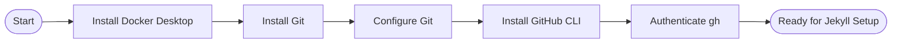

# Machine Setup

Install the tools you need before starting Jekyll development. This guide covers **macOS**, **Windows**, and **Linux**.



## Prerequisites at a Glance

| Tool | macOS | Windows | Linux | Required? |
|------|-------|---------|-------|-----------|
| Docker Desktop | `brew install --cask docker` | `winget install Docker.DockerDesktop` | [get.docker.com](https://get.docker.com) | Yes |
| Git | `brew install git` | `winget install Git.Git` | `apt install git` | Yes |
| GitHub CLI | `brew install gh` | `winget install GitHub.cli` | [pkg install](https://cli.github.com) | Yes |
| VS Code | `brew install --cask visual-studio-code` | `winget install Microsoft.VisualStudioCode` | `snap install code --classic` | Recommended |

## Step 1 — Install Docker Desktop

Docker runs your Jekyll site in an isolated container so you never fight Ruby version conflicts.

**macOS (Homebrew)**

```bash
brew install --cask docker
# Then open Docker.app to complete setup
open /Applications/Docker.app
```

**Windows (Winget)**

```powershell
winget install Docker.DockerDesktop
# Restart, then launch Docker Desktop from the Start menu
```

**Linux**

```bash
curl -fsSL https://get.docker.com | sh
sudo usermod -aG docker $USER
newgrp docker          # apply group without logging out
```

Verify:

```bash
docker --version && docker compose version
```

## Step 2 — Install Git

**macOS**

```bash
brew install git
```

**Windows**

```powershell
winget install Git.Git
```

**Linux**

```bash
sudo apt install git       # Debian/Ubuntu
sudo dnf install git       # Fedora/RHEL
```

## Step 3 — Configure Git

Replace the values below with your real GitHub username and the no-reply email from [github.com/settings/emails](https://github.com/settings/emails):

```bash
git config --global user.name "YourGitHubUsername"
git config --global user.email "ID+username@users.noreply.github.com"
git config --global core.editor "code --wait"
```

Verify:

```bash
git config --global --list
```


## Step 4 — Install GitHub CLI

**macOS**

```bash
brew install gh
```

**Windows**

```powershell
winget install GitHub.cli
```

**Linux**

```bash
sudo apt install gh        # Debian/Ubuntu (after adding the gh apt repo)
# Full instructions: https://cli.github.com/manual/installation
```

Authenticate:

```bash
gh auth login
# Choose: GitHub.com → HTTPS → Login with a web browser
# Copy the one-time code shown, press Enter, paste in the browser
```

## Step 5 — Install VS Code (Recommended)

**macOS**

```bash
brew install --cask visual-studio-code
```

**Windows**

```powershell
winget install Microsoft.VisualStudioCode
```

**Linux**

```bash
sudo snap install code --classic
```

Useful extensions for Jekyll work:

```bash
code --install-extension redhat.vscode-yaml
code --install-extension yzhang.markdown-all-in-one
code --install-extension sissel.shopify-liquid
code --install-extension ms-vscode-remote.remote-containers
code --install-extension ms-azuretools.vscode-docker
```

## Verify Everything

```bash
docker --version && docker compose version
git --version
gh --version
code --version
```


## macOS: Install All Tools with Homebrew

If you're on macOS and don't have Homebrew yet, install it first:

```bash
/bin/bash -c "$(curl -fsSL https://raw.githubusercontent.com/Homebrew/install/HEAD/install.sh)"
```

Then install everything in one go:

```bash
brew install git gh
brew install --cask docker visual-studio-code
```


## Troubleshooting

**Docker: permission denied (Linux)**

```bash
sudo usermod -aG docker $USER && newgrp docker
```

**Docker Desktop won't start (Windows)**

Ensure Hyper-V or WSL 2 is enabled. Run `wsl --install` in an elevated PowerShell, then restart.

**Port 4000 already in use**

```bash
lsof -i :4000          # find the PID
kill <PID>             # free the port
```

---

<div class="d-flex justify-content-between mt-5">
  <a href="/quickstart/" class="btn btn-outline-secondary">
    <i class="bi bi-arrow-left"></i> Back: Quick Start Overview
  </a>
  <a href="/quickstart/jekyll-setup/" class="btn btn-primary">
    Next: Jekyll Setup <i class="bi bi-arrow-right"></i>
  </a>
</div>
